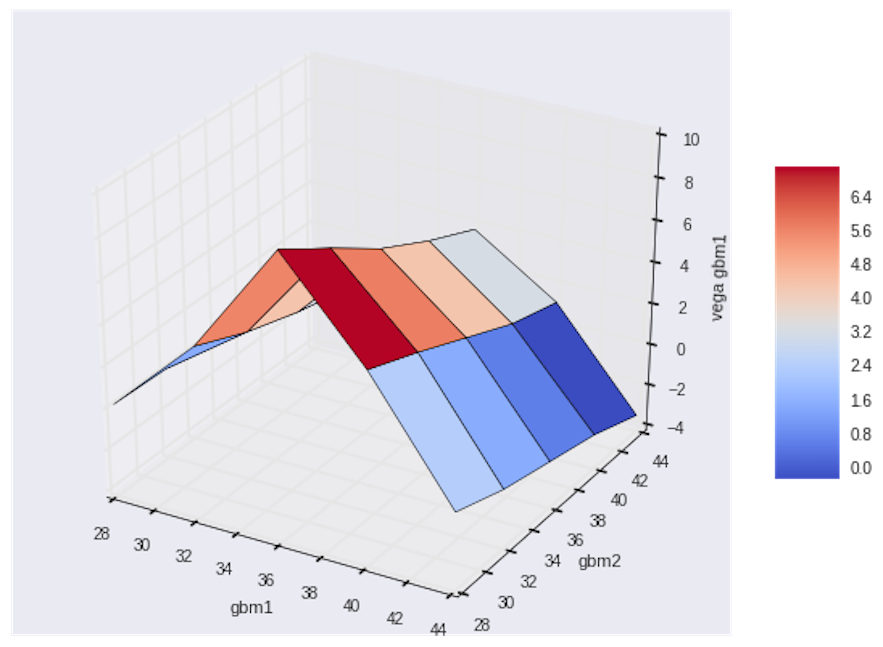

<!--
*** Thanks for checking out the Best-README-Template. If you have a suggestion
*** that would make this better, please fork the repo and create a pull request
*** or simply open an issue with the tag "enhancement".
*** Thanks again! Now go create something AMAZING! :D
-->

<!-- PROJECT SHIELDS -->
<!--
*** I'm using markdown "reference style" links for readability.
*** Reference links are enclosed in brackets [ ] instead of parentheses ( ).
*** See the bottom of this document for the declaration of the reference variables
*** for contributors-url, forks-url, etc. This is an optional, concise syntax you may use.
*** https://www.markdownguide.org/basic-syntax/#reference-style-links
-->

[![MIT License][license-shield]][license-url]
[![LinkedIn][linkedin-shield]][linkedin-url]

<!-- PROJECT LOGO -->
 

  

  <h3 align="center">Algorithmic Trading</h3>

  

    This repo is just beginning, but will be home to option pricing, financial model analysis, and removing biggest cause for failure in the market: human emotion!
     
    <a href="https://www.tdameritrade.com/"><strong>TD Ameritrade »</strong></a>
     
     
    <!-- <a href="https://www.tdameritrade.com/">Latest Model</a>
    ·
    <a href="https://anna-koretchko.ue.r.appspot.com/">Demo</a> -->

  

<!-- TABLE OF CONTENTS -->

  
Table of Contents

  <ol>
    <li>
      <a href="#about-the-project">About The Project</a>
      <ul>
        <li><a href="#built-with">Built With</a></li>
      </ul>
    </li>
    <li><a href="#usage">Usage</a></li>
    <li><a href="#license">License</a></li>
    <li><a href="#contact">Contact</a></li>
  </ol>

<!-- ABOUT THE PROJECT -->
## About The Project

Still currently working on this, very much in the beginning. But I am hoping to create a package that allows python and Finance to integrate seamlessly. Thus far, I have created cron tasks that will automatically text/email me updates as I see fit. I have fully integrated TD Ameritrade's API both for historical and streaming data.  

For obvious reasons, this is the only public aspect to this repo as the algorithms themselves will remain private. I have added simple examples as proof of concept but not serious working models.  

Therefore, this project shows the overall infrastructure used to deploy my working algorithms:

1. Automatically getting data
2. Automatically sending updates
3. Where/how models are trained and back tested
4. Websockets

But leaves out the actual algorithms themselves. 

**Hope this inspires you to start removing human bias and automate your trading...maybe even implementing some ML models if you feel so inclined (which I do).**

Python books I am using for reference:

1. [Python for Finance, 2nd Edition](https://learning.oreilly.com/library/view/python-for-finance/9781492024323/)
2. [Derivative Analytics with Python](https://learning.oreilly.com/library/view/derivatives-analytics-with/9781119037996/)
3. [Python for Algorithmic Trading](https://learning.oreilly.com/library/view/python-for-algorithmic/9781492053347/)

### Built With

* [Python](https://www.python.org/)
* [cron](https://man7.org/linux/man-pages/man8/cron.8.html)
* [TD Ameritrade API](https://developer.tdameritrade.com/apis)

<!-- LICENSE -->
## License

Distributed under the MIT License. See `LICENSE` for more information.

<!-- CONTACT -->
## Contact

* Anna Koretchko - [Personal Website](https://anna-koretchko.ue.r.appspot.com/index)
* Email - annakoretchko@gmail.com

<!-- MARKDOWN LINKS & IMAGES -->
<!-- https://www.markdownguide.org/basic-syntax/#reference-style-links -->
[contributors-shield]: https://img.shields.io/github/contributors/othneildrew/Best-README-Template.svg?style=for-the-badge
[contributors-url]: https://github.com/othneildrew/Best-README-Template/graphs/contributors
[forks-shield]: https://img.shields.io/github/forks/othneildrew/Best-README-Template.svg?style=for-the-badge
[forks-url]: https://github.com/othneildrew/Best-README-Template/network/members
[stars-shield]: https://img.shields.io/github/stars/othneildrew/Best-README-Template.svg?style=for-the-badge
[stars-url]: https://github.com/othneildrew/Best-README-Template/stargazers
[issues-shield]: https://img.shields.io/github/issues/othneildrew/Best-README-Template.svg?style=for-the-badge
[issues-url]: https://github.com/othneildrew/Best-README-Template/issues
[license-shield]: https://img.shields.io/github/license/othneildrew/Best-README-Template.svg?style=for-the-badge
[license-url]: https://github.com/annakoretchko/garmin_analysis/blob/master/LICENSE
[linkedin-shield]: https://img.shields.io/badge/-LinkedIn-black.svg?style=for-the-badge&logo=linkedin&colorB=555
[linkedin-url]: https://www.linkedin.com/in/anna-koretchko-1b5b0211a/
[product-screenshot]: images/screenshot.png

